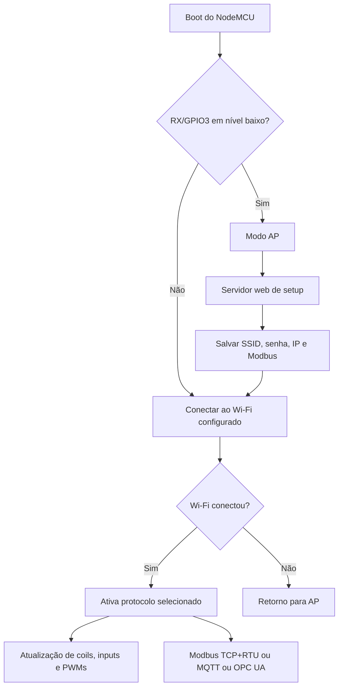
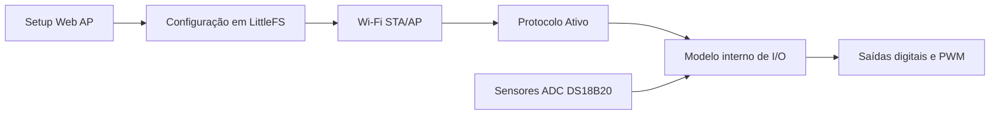
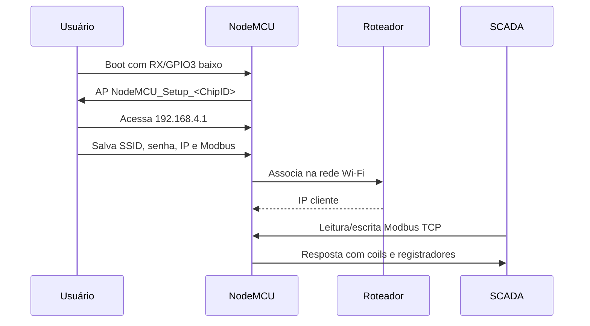
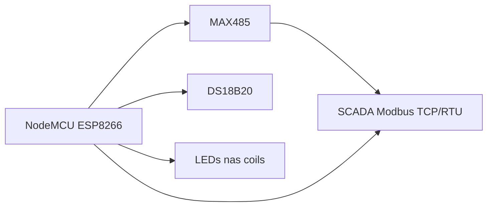

# Firmware NodeMCU SCADA Didático

Este firmware transforma um NodeMCU v2 (ESP8266) em um dispositivo de automação industrial didático, capaz de se comunicar via **Modbus TCP**, **Modbus RTU***, **MQTT** ou **OPC UA** — com o protocolo escolhido pelo usuário na interface web de configuração. Ele possui o seguintes I/Os físicos:

Saídas discretas - 2 que podem ser usadas para acionamento de uma ponte H interna ou Buzzer ou Rele.

Entradas digitais - 2 tipo contato seco externo ou switch onboard da PCB. A ED2 é usada para o nodemcu entrar no modo de setup duranta a inicialização.

Entrada analógica - 1 entrada anlógica com sinal de um potenciômetro onboard.

Sensor de temperatura - sensor de temperatura DS18B20.

Saídas discretas PWM - 3 usadas para movimento azimutal e elevação de servo motores de controlar a potência de aquecimento de uma resistência onboard.

É voltado para bancadas de automação, aulas de SCADA, testes de integração com IHM e experimentos com sensores e atuadores.

> 🧩 **Projeto da PCB:** Este firmware foi desenvolvido para a placa de circuito impresso didática disponível em [github.com/wvianna/pcb-moduloDidatico-SCADA-IoT](https://github.com/wvianna/pcb-moduloDidatico-SCADA-IoT). A PCB integra todos os componentes de I/O, sensores e interface RS485 em um único hardware, facilitando a montagem e reprodução em sala de aula.

---
---

**Autor:** William da Silva Vianna  
**Software Utilizado:** VScode + PlatformIO

---

## Índice

- [Firmware NodeMCU SCADA Didático](#firmware-nodemcu-scada-didático)
  - [Índice](#índice)
  - [1. O que este firmware faz](#1-o-que-este-firmware-faz)
  - [2. Como funciona — visão geral](#2-como-funciona--visão-geral)
    - [Arquitetura resumida](#arquitetura-resumida)
  - [3. Requisitos de hardware](#3-requisitos-de-hardware)
    - [Placa principal](#placa-principal)
    - [Sensores suportados](#sensores-suportados)
    - [Comunicação serial industrial](#comunicação-serial-industrial)
    - [Cargas e indicação visual](#cargas-e-indicação-visual)
  - [4. Pinagem usada pelo firmware](#4-pinagem-usada-pelo-firmware)
    - [Coils](#coils)
    - [Entradas discretas](#entradas-discretas)
    - [Input registers](#input-registers)
    - [Holding registers](#holding-registers)
    - [RS485 com MAX485](#rs485-com-max485)
  - [5. Primeiros passos — configuração inicial](#5-primeiros-passos--configuração-inicial)
    - [Entrando no modo AP](#entrando-no-modo-ap)
    - [Página web de configuração](#página-web-de-configuração)
    - [Seleção do protocolo ativo](#seleção-do-protocolo-ativo)
    - [Configuração padrão de fábrica](#configuração-padrão-de-fábrica)
  - [7. Protocolos de comunicação](#7-protocolos-de-comunicação)
  - [8. Referência da configuração persistida](#8-referência-da-configuração-persistida)
    - [Chaves Persistidas em LittleFS](#chaves-persistidas-em-littlefs)
    - [Regras de runtime](#regras-de-runtime)
    - [Modbus TCP](#modbus-tcp)
      - [Porta](#porta)
      - [Mapa de endereçamento Modbus](#mapa-de-endereçamento-modbus)
    - [Funções implementadas](#funções-implementadas)
      - [Ferramentas sugeridas](#ferramentas-sugeridas)
    - [Modbus RTU](#modbus-rtu)
    - [MQTT](#mqtt)
      - [Como conectar](#como-conectar)
      - [Tópicos usados](#tópicos-usados)
      - [Formato JSON publicado em `<topico_publicacao>`](#formato-json-publicado-em-topico_publicacao)
      - [Formato JSON aceito em `<topico_subscricao>`](#formato-json-aceito-em-topico_subscricao)
    - [OPC UA](#opc-ua)
      - [Tópicos UA usados](#tópicos-ua-usados)
      - [Formato JSON publicado (UA PubSub)](#formato-json-publicado-ua-pubsub)
      - [Comandos de saída](#comandos-de-saída)
      - [Integração com Node-RED](#integração-com-node-red)
    - [Comportamentos visuais e de diagnóstico](#comportamentos-visuais-e-de-diagnóstico)
  - [9. Compilação e gravação](#9-compilação-e-gravação)
    - [Compilar](#compilar)
    - [Gravar na placa](#gravar-na-placa)
    - [Abrir monitor serial](#abrir-monitor-serial)
  - [10. Troubleshooting](#10-troubleshooting)
    - [A placa responde a ping mas não abre a porta 502](#a-placa-responde-a-ping-mas-não-abre-a-porta-502)
    - [O modo AP não apareceu](#o-modo-ap-não-apareceu)
    - [A saída não acionou](#a-saída-não-acionou)
    - [RS485 não respondeu](#rs485-não-respondeu)
  - [11. Diagramas](#11-diagramas)
    - [Fluxo de configuração e operação](#fluxo-de-configuração-e-operação)
    - [Visão de ligação simplificada](#visão-de-ligação-simplificada)
  - [12. Arquivos importantes do projeto](#12-arquivos-importantes-do-projeto)
  - [13. Testes de integração](#13-testes-de-integração)
    - [Modbus TCP — leitura e escrita](#modbus-tcp--leitura-e-escrita)
      - [Leitura rápida — script Python (somente leitura)](#leitura-rápida--script-python-somente-leitura)
      - [Saídas — script Python (coils e PWM)](#saídas--script-python-coils-e-pwm)
      - [Monitorar entrada analógica — script Python](#monitorar-entrada-analógica--script-python)
    - [Modbus RTU — leitura e escrita](#modbus-rtu--leitura-e-escrita)
    - [MQTT — publish e subscribe](#mqtt--publish-e-subscribe)
      - [Assinar o tópico de entradas (leitura)](#assinar-o-tópico-de-entradas-leitura)
      - [Ciclos de teste — PWM (holding registers)](#ciclos-de-teste--pwm-holding-registers)
      - [Ciclos de teste — saídas discretas (coils)](#ciclos-de-teste--saídas-discretas-coils)
    - [OPC UA — PubSub via MQTT](#opc-ua--pubsub-via-mqtt)
      - [Assinar o tópico de entradas UA (leitura)](#assinar-o-tópico-de-entradas-ua-leitura)
      - [Ciclos de teste UA — PWM (holding registers)](#ciclos-de-teste-ua--pwm-holding-registers)
      - [Ciclos de teste UA — saídas discretas (coils)](#ciclos-de-teste-ua--saídas-discretas-coils)
      - [Integração com Node-RED (OPC UA Server completo)](#integração-com-node-red-opc-ua-server-completo)
      - [Diagnóstico rápido com Python](#diagnóstico-rápido-com-python)

---

## 1. O que este firmware faz

| Capacidade | Detalhe |
| --- | --- |
| Protocolo de comunicação | Modbus TCP, Modbus RTU, MQTT ou OPC UA — selecionável pela web (modo exclusivo) |
| Interface de configuração | Página web via Wi-Fi, sem necessidade de recompilar |
| Sensores | ADC (A0) e DS18B20 via 1-Wire |
| Saídas digitais | 2 coils mapeados em GPIOs |
| Saídas analógicas (PWM) | 3 canais holding registers |
| Entradas digitais | 2 discrete inputs |
| Persistência | LittleFS (memória flash interna do ESP8266) |
| Rede | IP estático configurável |

> **Nota didática:** cada protocolo ativo é exclusivo — ao selecionar MQTT, por exemplo, Modbus fica inativo e vice-versa. Isso simplifica o entendimento do comportamento do dispositivo.

## 2. Como funciona — visão geral



### Arquitetura resumida

Todo o firmware usa um **modelo interno de registradores** como fonte única de dados. Qualquer protocolo ativo lê e escreve nesse modelo; os pinos físicos refletem o estado do modelo a cada ciclo do loop.



> **Conceito:** o modelo interno evita divergência entre o que o protocolo enxerga e o que o hardware executa.

## 3. Requisitos de hardware

### Placa principal

- NodeMCU v2 com ESP8266

### Sensores suportados

- DS18B20

### Comunicação serial industrial

- Módulo MAX485 ou equivalente RS485 half-duplex

### Cargas e indicação visual

- Resistência de aquecimento via pwm, buzzer, rele ou ponte H Completa, servo motores. Todas as saída possue LEDs de indicação.

## 4. Pinagem usada pelo firmware

O mesmo mapeamento de I/O vale para todos os protocolos (Modbus, MQTT e OPC UA). O significado dos dados muda conforme o protocolo, mas os pinos físicos permanecem os mesmos.

### Coils

| Tipo | Base 1 | Base 0 | Função | Pino | GPIO |
| --- | ---: | ---: | --- | --- | --- |
| Coil | 00001 | 0 | Saída discreta 1 | D0 | GPIO16 |
| Coil | 00002 | 1 | Saída discreta 2 | TX | GPIO1 |

### Entradas discretas

| Tipo | Base 1 | Base 0 | Função | Pino | GPIO |
| --- | ---: | ---: | --- | --- | --- |
| Discrete Input | 10001 | 0 | Entrada discreta 1 | D8 | GPIO15 |
| Discrete Input | 10002 | 1 | Entrada discreta 2 | RX | GPIO3 (também gatilho de setup AP) |

### Input registers

| Tipo | Base 1 | Base 0 | Função | Pino | Faixa |
| --- | ---: | ---: | --- | --- | --- |
| Input Register | 30001 | 0 | ADC | A0 | 0..1023 |
| Input Register | 30002 | 1 | DS18B20 | D2 / GPIO4 | temperatura x10 |

### Holding registers

| Tipo | Base 1 | Base 0 | Função | Pino | Faixa |
| --- | ---: | ---: | --- | --- | --- |
| Holding Register | 40001 | 0 | PWM azimute | D7 / GPIO13 | 0..1023 |
| Holding Register | 40002 | 1 | PWM elevação | D3 / GPIO0 | 0..1023 |
| Holding Register | 40003 | 2 | PWM resistência de aquecimento | D1 / GPIO5 | 0..1023 |

> As saídas PWM operam em **100 Hz** (`analogWriteFreq(100)`), com duty cycle de 0 a 1023 (0 a 100 %).

### RS485 com MAX485

| Sinal MAX485 | Pino NodeMCU | GPIO |
| --- | --- | --- |
| RO | D5 | GPIO14 |
| DI | D6 | GPIO12 |
| DE + RE | D4 | GPIO2 |

## 5. Primeiros passos — configuração inicial

Antes de usar qualquer protocolo, configure o dispositivo uma única vez via modo AP. Essa configuração fica salva na flash e persiste após desligamento.

### Entrando no modo AP

O firmware entra em setup se `RX / GPIO3` (**entrada discreta ED2**) estiver em nível baixo durante o boot.

Procedimento:

1. Coloque `RX / GPIO3` em nível baixo (s**entrada discreta ED2**).
2. Ligue ou resete a placa.
3. Procure a rede Wi-Fi `NodeMCU_Setup_<ChipID>`.
4. Conecte-se à rede.
5. Acesse `192.168.4.1` no navegador.


### Página web de configuração

Ao acessar `192.168.4.1`, você verá o painel de setup. Preencha os campos e clique em **Salvar e Conectar**. A placa reinicia no modo cliente e ativa o protocolo escolhido.

A página permite configurar:

- SSID
- senha da rede Wi-Fi
- IP fixo
- máscara
- gateway
- DNS
- protocolo ativo (`Modbus`, `MQTT`, `OPC UA`)
- endereço Modbus
- porta Modbus TCP
- baud rate
- paridade
- stop bits
- broker MQTT
- porta MQTT
- usuário MQTT
- senha MQTT
- tópico base MQTT
- OPC UA Publisher ID
- OPC UA DataSet Writer ID

Se os dados forem inválidos, o dispositivo continua em AP para correção.

### Seleção do protocolo ativo

O campo **Protocolo Ativo** é obrigatório e fica em destaque no topo do formulário:

| Opção | Quando usar |
| --- | --- |
| `Modbus TCP` | Integração com SCADA, IHM ou mestre Modbus via Ethernet (porta 502 por padrão, configurável) |
| `Modbus RTU` | Integração com SCADA/IHM via barramento RS485 |
| `MQTT` | Integração com Node-RED, dashboards IoT ou brokers |
| `OPC UA` | OPC UA PubSub via MQTT — integração com SCADA moderno e Node-RED |

Apenas um protocolo opera por vez. Os demais ficam completamente inativos.

### Configuração padrão de fábrica

Se nenhuma configuração tiver sido salva, o dispositivo usa estes valores padrão:

- SSID: `linus`
- senha: `lapela593`
- IP: `192.168.100.200`
- máscara: `255.255.255.0`
- gateway: `192.168.100.1`
- DNS: `8.8.8.8`
- Protocolo ativo: `modbustcp`
- Modbus ID: `1`
- Porta Modbus TCP: `502`
- baud RTU: `9600`
- paridade: `N`
- stop bits: `1`
- MQTT broker: `192.168.100.10`
- MQTT porta: `1883`
- MQTT tópico base: `nodemcu`
- OPC UA Publisher ID: `NodeMCU_<ChipID>`
- OPC UA DataSet Writer ID: `1`

## 7. Protocolos de comunicação

Esta seção detalha como acessar e usar cada protocolo após a placa estar conectada ao Wi-Fi.

---

## 8. Referência da configuração persistida

### Chaves Persistidas em LittleFS

Arquivo persistido: `/config.txt`

| Chave | Tipo | Obrigatória em | Descrição |
| --- | --- | --- | --- |
| `ssid` | string | todos os modos | SSID da rede Wi-Fi |
| `psk` | string | todos os modos | senha da rede Wi-Fi |
| `ip` | ipv4 | todos os modos | IP estático |
| `mask` | ipv4 | todos os modos | máscara de rede |
| `gateway` | ipv4 | todos os modos | gateway |
| `dns` | ipv4 | todos os modos | DNS |
| `protocol` | enum (`modbustcp`,`modbusrtu`,`mqtt`,`opcua`) | todos os modos | protocolo ativo no runtime |
| `deviceId` | uint8 | `modbustcp`,`modbusrtu` | endereço Modbus (1..247) |
| `modbusTcpPort` | uint16 | `modbustcp` | porta TCP do serviço Modbus TCP (1..65535; padrão `502`) |
| `baud` | uint32 | `modbusrtu` | baud rate RTU |
| `parity` | enum (`N`,`E`,`O`) | `modbusrtu` | paridade RTU |
| `stopBits` | uint8 | `modbusrtu` | stop bits RTU (1 ou 2) |
| `mqttBroker` | string | `mqtt` | endereço do broker |
| `mqttPort` | uint16 | `mqtt` | porta do broker (1..65535) |
| `mqttUser` | string | `mqtt` (ThingsBoard) / opcional em `mqtt` (geral) | usuário do broker; no ThingsBoard é o Access Token |
| `mqttPass` | string | opcional em `mqtt` | senha do broker (não usada no modo ThingsBoard) |
| `mqttMode` | enum (`geral`,`thingsboard`) | `mqtt` | modo MQTT: geral ou ThingsBoard |
| `mqttPublishTopic` | string | opcional em `mqtt` (geral) | tópico principal de publicação; vazio usa `<base>/inputs` |
| `mqttSubscribeTopic` | string | opcional em `mqtt` (geral) | tópico de subscrição; vazio usa `<base>/outputs/set` |
| `mqttTopicBase` | string | opcional em `mqtt`/`opcua` | prefixo usado pelo OPC UA e como fallback dos tópicos MQTT |
| `opcUaPublisherId` | string | `opcua` | Publisher ID no ecossistema OPC UA PubSub |
| `opcUaDataSetWriterId` | uint16 | `opcua` | DataSetWriter ID (1..65535) |

Comportamento de compatibilidade:

- Se o arquivo não existir, o firmware usa defaults de fábrica.
- Se chaves novas estiverem ausentes (arquivo legado), os defaults desses campos são aplicados.
- Se configuração inválida for detectada para o modo ativo, o firmware mantém AP para correção.

### Regras de runtime

- Somente um protocolo fica ativo por vez, definido na página de setup.
- As configurações de rede estática (`IP`, `máscara`, `gateway`, `DNS`) são obrigatórias em todos os modos.
- O mapa de I/O (coils, entradas discretas, input registers e holding registers) permanece o mesmo, independentemente do protocolo ativo.

### Modbus TCP

Requer protocolo `Modbus TCP` selecionado no setup.

#### Porta

- Configurável na página de setup (campo **Modbus TCP Porta**); padrão `502`.
- O serviço escuta na porta persistida em `/config.txt` (`modbusTcpPort`).
- Suporta **múltiplos clientes Modbus TCP simultâneos** (até 4) — Python, Node-RED e SCADA/IHM podem ler/escrever ao mesmo tempo.
- Para conexões fora do padrão, use a mesma porta nos scripts/SCADA (ex.: `python test/modbus-read.py <ip> <porta> 1`).

#### Mapa de endereçamento Modbus

Endereçamento idêntico ao exibido no help da página web de setup:

| Endereço | Tipo | Faixa | Descrição |
| --- | --- | --- | --- |
| 00001-00002 | Coil (FC 01/05) | 0/1 | Saídas binárias |
| 10001-10002 | Discrete Input (FC 02) | 0/1 | Entradas binárias (somente leitura) |
| 30001 | Input Register (FC 04) | 0-1023 | ADC |
| 30002 | Input Register (FC 04) | 0-12500 | DS18B20 temperatura (x10, graus Celsius) |
| 40001 | Holding Register (FC 03/06) | 0-1023 | PWM Azimute |
| 40002 | Holding Register (FC 03/06) | 0-1023 | PWM Elevação |
| 40003 | Holding Register (FC 03/06) | 0-1023 | PWM Resistência de aquecimento |

> O firmware aguarda no mínimo **500 ms** entre o disparo e a leitura da conversão do DS18B20
> (`DS18B20_MIN_CONVERSION_WAIT_MS`), evitando valores `0` transitórios no registrador 30002
> (falhas transitórias de leitura mantêm o último valor válido).

### Funções implementadas

- `0x01` Read Coils
- `0x02` Read Discrete Inputs
- `0x03` Read Holding Registers
- `0x04` Read Input Registers
- `0x05` Write Single Coil
- `0x06` Write Single Register

#### Ferramentas sugeridas

- QModMaster
- Modbus Poll
- Qmodbus
- SCADA com driver Modbus TCP ou RTU
- Scripts Python com `pymodbus`

> **Nota:** após reboot, aguarde alguns segundos antes de conectar — o servidor TCP pode demorar a subir após o Wi-Fi associar.

### Modbus RTU

Requer protocolo `Modbus RTU` selecionado. O firmware mantém banco RTU sincronizado com o modelo interno via barramento RS485: entradas fluem do modelo para o banco RTU e saídas fluem do banco RTU para o modelo.

Parâmetros configuráveis:

- slave ID configurável
- baud configurável
- paridade configurável
- stop bits configurável

### MQTT

Requer protocolo `MQTT` selecionado no setup. O dispositivo se conecta ao broker definido e opera de forma não bloqueante.

#### Como conectar

- Selecionar `MQTT` como protocolo ativo no setup web.
- Escolher o modo MQTT: **Geral** ou **ThingsBoard**.
- No modo **Geral**: definir broker, porta, usuário/senha (se necessário), tópico de publicação e tópico de subscrição.
- No modo **ThingsBoard**: o tópico de telemetria é fixo (`v1/devices/me/telemetry`), o usuário é o Access Token do dispositivo e **não há senha**; basta definir broker, porta e token.

#### Tópicos usados

**Modo MQTT Geral** (tópicos configuráveis no setup; se vazios, usam `<topico_base>`):

| Direção | Tópico | Descrição |
| --- | --- | --- |
| Publish (NodeMCU → broker) | `<topico_publicacao>` (padrão `<topico_base>/inputs`) | Entradas publicadas periodicamente |
| Subscribe (broker → NodeMCU) | `<topico_subscricao>` (padrão `<topico_base>/outputs/set`) | Comandos de saída |
| Publish (NodeMCU → broker) | `<topico_base>/status` | Sinaliza `online` ao conectar |

**Modo MQTT ThingsBoard** (tópicos fixos):

| Direção | Tópico | Descrição |
| --- | --- | --- |
| Publish (NodeMCU → broker) | `v1/devices/me/telemetry` | Telemetria/entradas publicadas periodicamente (fixo) |
| Subscribe (broker → NodeMCU) | `v1/devices/me/rpc/request/+` | Comandos RPC de saída (fixo) |
| Publish (NodeMCU → broker) | `v1/devices/me/attributes` | Sinaliza atributo `online` ao conectar |

#### Formato JSON publicado em `<topico_publicacao>`

Publicado automaticamente a cada ~1,2 segundos:

```json
{
  "ts_ms": 123456,
  "ip": "192.168.100.200",
  "discrete_inputs": [0, 1],
  "input_registers": [512, 255]
}
```

#### Formato JSON aceito em `<topico_subscricao>`

Publicado por um cliente MQTT para acionar saídas:

```json
{
  "coils": [1, 0, 1],
  "holding_registers": [100, 450, 900]
}
```

Regras:

- `coils`: até 2 posições, valores booleanos/0/1.
- `holding_registers`: até 3 posições, faixa `0..1023` (valores fora da faixa são limitados).
- QoS atual: `0`.

### OPC UA

Requer protocolo `OPC UA` selecionado no setup. Opera via **OPC UA PubSub (IEC 62541-14)** transportando payloads JSON sobre MQTT — o mesmo broker configurado nos campos MQTT acima.

| Aspecto | Estado |
| --- | --- |
| Seleção de modo no setup | ✅ Disponível |
| Runtime OPC UA PubSub | ✅ Funcional |
| Transporte | MQTT (reutiliza broker/porta/user/pass) |

#### Tópicos UA usados

| Direção | Tópico | Descrição |
| --- | --- | --- |
| Publish (NodeMCU → broker) | `<topico_base>/opcua/inputs` | Payload UA PubSub JSON com todas as entradas |
| Subscribe (broker → NodeMCU) | `<topico_base>/opcua/outputs/set` | Comandos de saída (mesmo formato MQTT) |
| Publish (NodeMCU → broker) | `<topico_base>/opcua/status` | Sinaliza `online` ao conectar |

#### Formato JSON publicado (UA PubSub)

Publicado automaticamente a cada ~1,2 segundos:

```json
{
  "MessageId": "12345-AABBCC",
  "MessageType": "ua-data",
  "PublisherId": "NodeMCU_AABBCC",
  "DataSetWriterId": 1,
  "Payload": {
    "Coil_0": true,
    "Coil_1": false,
    "DiscreteInput_0": false,
    "DiscreteInput_1": true,
    "ADC": 512,
    "DS18B20": 255,
    "PWM_Azimuth": 100,
    "PWM_Elevation": 450,
    "PWM_Heater": 900
  }
}
```

#### Comandos de saída

Mesmo formato do MQTT puro — publique no tópico `<topico_base>/opcua/outputs/set`:

```json
{"coils":[1,0,1],"holding_registers":[100,450,900]}
```

#### Integração com Node-RED

Para expor um servidor OPC UA completo a partir dos dados do NodeMCU:

1. Instale os nós `node-red-contrib-opcua` no Node-RED.
2. Adicione um nó `mqtt in` assinando `<topico_base>/opcua/inputs`.
3. Adicione um nó `function` para extrair os campos do `Payload` e mapear para nós OPC UA.
4. Adicione um nó `opcua-server` expondo os nós de I/O.
5. Clientes como **UaExpert** conectam em `opc.tcp://<ip_node_red>:4840`.

- O endpoint `GET /health` expõe `opcuaRuntimeSupported: true` para diagnóstico.

### Comportamentos visuais e de diagnóstico

| Situação | Comportamento |
| --- | --- |

| Wi-Fi conectado | LED para de piscar; protocolo inicia |
| Consultar estado | `GET http://<ip>/health` retorna JSON com estado, protocolo ativo e `opcuaRuntimeSupported` |
| Reboot necessário | Após salvar configuração, a placa reinicia automaticamente |

## 9. Compilação e gravação

### Compilar

```bash
pio run
```

### Gravar na placa

```bash
pio run -t upload
```

### Abrir monitor serial

```bash
pio device monitor
```

Observação:

- o projeto usa `monitor_speed = 115200` em `platformio.ini`

## 10. Troubleshooting

### A placa responde a ping mas não abre a porta 502

Isso pode acontecer logo após reboot/upload, ou se a porta configurada no setup for diferente de `502`.

Solução:

- aguarde alguns segundos e tente novamente
- confirme no setup web o valor do campo **Modbus TCP Porta** (padrão `502`)

### O modo AP não apareceu

Verifique:

- se `RX / GPIO3` foi realmente mantido em nível baixo durante o boot
- se a placa reiniciou corretamente

### A saída não acionou

Verifique:

- resistor e polaridade do LED
- aterramento comum
- se o pino em uso não está conflitando com o hardware da placa

### RS485 não respondeu

Verifique:

- ligação `RO`, `DI`, `DE/RE`
- baud rate
- slave ID
- polaridade do barramento `A/B`

## 11. Diagramas

### Fluxo de configuração e operação



### Visão de ligação simplificada



## 12. Arquivos importantes do projeto

| Arquivo | Conteúdo |
| --- | --- |
| `src/main.cpp` | Código principal do firmware |
| `platformio.ini` | Configuração de build e dependências |
| `docs/requisitos.txt` | Requisitos técnicos e funcionais |
| `docs/mapeamentopinosmb.txt` | Mapa de pinos em formato CSV |
| `docs/handoff-proximo-agente.md` | Handoff técnico com estado atual |
| `spec/spec-process-plano-desenvolvimento-firmware-modbus-nodemcu.md` | Plano de desenvolvimento e critérios de aceite |
| `test/mqtt-regressao-checklist.md` | Roteiro de testes MQTT |
| `test/mqtt-payloads-exemplo.json` | Exemplos de payloads MQTT |

---

## 13. Testes de integração

Exemplos práticos de leitura e escrita para cada protocolo. Execute após a placa estar conectada ao Wi-Fi com o protocolo correspondente selecionado.

---

### Modbus TCP — leitura e escrita

Requer: `pip install pymodbus`

```python
#!/usr/bin/env python3
"""Teste Modbus TCP: leitura e escrita de coils, entradas e registradores."""
from pymodbus.client import ModbusTcpClient
import time

HOST = "192.168.100.200"
PORT = 502

client = ModbusTcpClient(HOST, port=PORT)
client.connect()

# --- Leitura de entradas discretas (10001-10002) ---
di = client.read_discrete_inputs(0, 2)
print("Discrete inputs:", di.bits[:2])

# --- Leitura de input registers (30001-30002) ---
ir = client.read_input_registers(0, 2)
print(f"ADC: {ir.registers[0]}  DS18B20: {ir.registers[1] / 10:.1f}°C")

# --- Ciclos de escrita e leitura de coils ---
print("\n=== Teste coils ===")
for ciclo in range(1, 4):
    client.write_coil(0, True)
    client.write_coil(1, True)
    r = client.read_coils(0, 2)
    print(f"[Ciclo {ciclo}] ON  -> coils: {r.bits[:2]}")
    time.sleep(2)

    client.write_coil(0, False)
    client.write_coil(1, False)
    r = client.read_coils(0, 2)
    print(f"[Ciclo {ciclo}] OFF -> coils: {r.bits[:2]}")
    time.sleep(2)

# --- Ciclos de escrita e leitura de holding registers (PWM) ---
print("\n=== Teste PWM (holding registers) ===")
for ciclo in range(1, 4):
    client.write_register(0, 1023)
    client.write_register(1, 1023)
    client.write_register(2, 1023)
    r = client.read_holding_registers(0, 3)
    print(f"[Ciclo {ciclo}] MAX -> hregs: {r.registers}")
    time.sleep(2)

    client.write_register(0, 0)
    client.write_register(1, 0)
    client.write_register(2, 0)
    r = client.read_holding_registers(0, 3)
    print(f"[Ciclo {ciclo}] MIN -> hregs: {r.registers}")
    time.sleep(2)

client.close()
```

#### Leitura rápida — script Python (somente leitura)

Há um script pronto em `test/modbus-read.py` que lê todos os registradores do módulo
(**somente leitura** — não altera saídas) e imprime em formato de tabela.

Requer: `pip install pymodbus` (pymodbus ≥ 3.x).

```bash
# Uso: python test/modbus-read.py [HOST] [PORT] [UNIT_ID]
python3 test/modbus-read.py 192.168.100.204 502 1
```

Lê:

- Coils `00001..00002` (FC 0x01) — saídas binárias
- Discrete inputs `10001..10002` (FC 0x02) — entradas binárias
- Input registers `30001..30002` (FC 0x04) — ADC e temperatura DS18B20 (valor x10)
- Holding registers `40001..40003` (FC 0x03) — PWM azimute/elevação/resistência

Exemplo de saída (dispositivo com Modbus ativo em `192.168.100.204`):

```text
Conectando em Modbus TCP 192.168.100.204:502 (unit_id=1) ...
Conectado!

Coils (FC 0x01):
      1 (coil 0) -> 0
      2 (coil 1) -> 0

Discrete inputs (FC 0x02):
      1 (discrete 0) -> 0
      2 (discrete 1) -> 1

Input registers (FC 0x04):
  30001 (input reg 0 / ADC)     -> 1023
  30002 (input reg 1 / DS18B20) -> 316 (31.6 C)

Holding registers (FC 0x03):
      1 (holding 0) -> 0
      2 (holding 1) -> 0
      3 (holding 2) -> 0
```

> **Nota:** o dispositivo precisa estar com o protocolo **Modbus** selecionado no setup web.
> Se o modo ativo for MQTT ou OPC UA, a porta 502 não responde às leituras.

#### Saídas — script Python (coils e PWM)

O script `test/modbus-outputs.py` testa as saídas do módulo (escrita via Modbus TCP):

- **Coils** `00001..00002`: piscam **3 vezes**, cada ciclo com intervalo de **2 s** (ON 2 s → OFF 2 s).
- **Holding registers** `40001..40003` (PWM): variam de **0 a 100 %** em passos de **25 %**
  (0, 25, 50, 75, 100), intervalo de **2 s**, e retornam a **0 %** ao final (estado seguro).

Requer: `pip install pymodbus` (pymodbus ≥ 3.x).

```bash
# Uso: python test/modbus-outputs.py [HOST] [PORT] [UNIT_ID] [--coils-only]
python3 test/modbus-outputs.py 192.168.100.204 502 1
# Somente as saídas digitais (coils), sem o teste de PWM:
python3 test/modbus-outputs.py 192.168.100.204 502 1 --coils-only
```

Exemplo de saída:

```text
=== Teste coils (piscar 3x, intervalo 2 s) ===
[1] ON  -> coils: [True, True]
[1] OFF -> coils: [False, False]
...
=== Teste PWM (holding registers, 0 a 100%, step 25%, intervalo 2 s) ===
  0% -> valor    0 | hregs: [0, 0, 0]
 25% -> valor  256 | hregs: [256, 256, 256]
 50% -> valor  512 | hregs: [512, 512, 512]
 75% -> valor  767 | hregs: [767, 767, 767]
100% -> valor 1023 | hregs: [1023, 1023, 1023]
Reset -> hregs: [0, 0, 0]
```

> **Atenção:** este teste **aciona as saídas físicas** (relés/atuadores nos coils e PWM nos
> motores/resistência). O `40003` controla a **resistência de aquecimento** — o teste é curto
> (2 s por passo) e ao final todas as saídas voltam a **0**. Confirme que a bancada está pronta.

#### Monitorar entrada analógica — script Python

O script `test/modbus-analog-monitor.py` lê a entrada analógica (`30001` / ADC / pino `A0`)
a cada **2 segundos**, com timestamp, até `Ctrl+C` ou por N amostras.

Requer: `pip install pymodbus` (pymodbus ≥ 3.x).

```bash
# Uso: python test/modbus-analog-monitor.py [HOST] [PORT] [UNIT_ID] [SAMPLES]
# 10 amostras (uma a cada 2 s) -> ~20 s de monitoramento
python3 test/modbus-analog-monitor.py 192.168.100.204 502 1 10
# sem o 4º argumento, roda até Ctrl+C
python3 test/modbus-analog-monitor.py
```

Exemplo de saída:

```text
[20:38:40] ADC (30001) = 1023
[20:38:42] ADC (30001) = 1023
[20:38:45] ADC (30001) = 8
...
```

---

### Modbus RTU — leitura e escrita

Requer: `pip install pymodbus` e adaptador USB-RS485.

```python
#!/usr/bin/env python3
"""Teste Modbus RTU via RS485."""
from pymodbus.client import ModbusSerialClient
import time

client = ModbusSerialClient(
    port="/dev/ttyUSB0",  # ajuste conforme o adaptador
    baudrate=9600,
    parity="N",
    stopbits=1,
    bytesize=8,
)
client.connect()

SLAVE = 1  # device ID configurado no setup

# --- Leitura de coils e registradores ---
r = client.read_coils(0, 2, slave=SLAVE)
print("Coils:", r.bits[:3])

r = client.read_input_registers(0, 2, slave=SLAVE)
print(f"ADC: {r.registers[0]}  DS18B20: {r.registers[1] / 10:.1f}°C")

# --- Escrita de coil e holding register ---
client.write_coil(0, True, slave=SLAVE)
time.sleep(1)
client.write_coil(0, False, slave=SLAVE)

client.write_register(0, 512, slave=SLAVE)  # PWM 50%
time.sleep(1)
client.write_register(0, 0, slave=SLAVE)

client.close()
```

---

### MQTT — publish e subscribe

Requer: `mosquitto_pub` e `mosquitto_sub` (`sudo apt install mosquitto-clients`).

#### Assinar o tópico de entradas (leitura)

```bash
# Monitora as entradas publicadas pelo NodeMCU a cada ~1,2s
mosquitto_sub -h 192.168.100.200 -p 1883 -t "nodemcu/inputs" -v
```

Exemplo de resposta recebida:

```json
{"ts_ms":12345,"ip":"192.168.100.200","discrete_inputs":[0,1],"input_registers":[512,255]}
```

#### Ciclos de teste — PWM (holding registers)

```bash
BROKER=192.168.100.200
PORT=1883
TOPIC="nodemcu/outputs/set"

for i in 1 2 3; do
  echo "[Ciclo $i] PWM -> MAX"
  mosquitto_pub -h $BROKER -p $PORT -t "$TOPIC" \
    -m '{"holding_registers":[1023,1023,1023]}'
  sleep 2
  echo "[Ciclo $i] PWM -> 0"
  mosquitto_pub -h $BROKER -p $PORT -t "$TOPIC" \
    -m '{"holding_registers":[0,0,0]}'
  sleep 2
done
```

#### Ciclos de teste — saídas discretas (coils)

```bash
BROKER=192.168.100.200
PORT=1883
TOPIC="nodemcu/outputs/set"

for i in 1 2 3; do
  echo "[Ciclo $i] Coils -> 1"
  mosquitto_pub -h $BROKER -p $PORT -t "$TOPIC" \
    -m '{"coils":[1,1,1]}'
  sleep 2
  echo "[Ciclo $i] Coils -> 0"
  mosquitto_pub -h $BROKER -p $PORT -t "$TOPIC" \
    -m '{"coils":[0,0,0]}'
  sleep 2
done
```

---

### OPC UA — PubSub via MQTT

O modo OPC UA opera via PubSub sobre o mesmo broker MQTT. Os payloads seguem o formato OPC UA PubSub JSON (IEC 62541-14).

#### Assinar o tópico de entradas UA (leitura)

```bash
mosquitto_sub -h 192.168.100.200 -p 1883 -t "nodemcu/opcua/inputs" -v
```

Exemplo de resposta recebida:

```json
{"MessageId":"12345-AABBCC","MessageType":"ua-data","PublisherId":"NodeMCU_AABBCC","DataSetWriterId":1,"Payload":{"Coil_0":false,"Coil_1":true,"DiscreteInput_0":false,"DiscreteInput_1":true,"ADC":512,"DS18B20":255,"PWM_Azimuth":100,"PWM_Elevation":450,"PWM_Heater":900}}
```

#### Ciclos de teste UA — PWM (holding registers)

```bash
BROKER=192.168.100.200
PORT=1883
TOPIC="nodemcu/opcua/outputs/set"

for i in 1 2 3; do
  echo "[Ciclo $i] PWM -> MAX"
  mosquitto_pub -h $BROKER -p $PORT -t "$TOPIC" \
    -m '{"holding_registers":[1023,1023,1023]}'
  sleep 2
  echo "[Ciclo $i] PWM -> 0"
  mosquitto_pub -h $BROKER -p $PORT -t "$TOPIC" \
    -m '{"holding_registers":[0,0,0]}'
  sleep 2
done
```

#### Ciclos de teste UA — saídas discretas (coils)

```bash
BROKER=192.168.100.200
PORT=1883
TOPIC="nodemcu/opcua/outputs/set"

for i in 1 2 3; do
  echo "[Ciclo $i] Coils -> 1"
  mosquitto_pub -h $BROKER -p $PORT -t "$TOPIC" \
    -m '{"coils":[1,1,1]}'
  sleep 2
  echo "[Ciclo $i] Coils -> 0"
  mosquitto_pub -h $BROKER -p $PORT -t "$TOPIC" \
    -m '{"coils":[0,0,0]}'
  sleep 2
done
```

#### Integração com Node-RED (OPC UA Server completo)

Fluxo de exemplo para expor os dados do NodeMCU como servidor OPC UA:

1. Instale `node-red-contrib-opcua` no Node-RED.
1. Importe o arquivo `test/node-red-opcua-flow.json` no menu *Import* do Node-RED.
1. Ajuste o broker MQTT se necessário (endereço e porta).
1. Conecte o **UaExpert** em `opc.tcp://<ip_do_node_red>:4840`.

O fluxo assina `nodemcu/opcua/inputs`, extrai cada campo do Payload e atualiza os nós OPC UA no servidor. A árvore de nós expõe:

```text
NodeMCU
├── Coils
│   ├── Coil_0        (Boolean)
│   ├── Coil_1        (Boolean)
├── DiscreteInputs
│   ├── DiscreteInput_0 (Boolean)
│   └── DiscreteInput_1 (Boolean)
├── InputRegisters
│   ├── ADC           (Int16)
│   └── DS18B20       (Int16)  → temperatura ×10
└── PWMs
    ├── PWM_Azimuth   (Int16)
    ├── PWM_Elevation (Int16)
    └── PWM_Heater    (Int16)
```

> **Para ler de volta os valores do servidor OPC UA**, importe também `test/node-red-opcua-reader-flow.json`. Esse fluxo lê todos os nós a cada 3 segundos e exibe no debug do Node-RED. Além disso, expõe um endpoint HTTP `GET http://<node_red_ip>:1880/api/nodemcu` que retorna os valores em JSON sob demanda.

#### Diagnóstico rápido com Python

Requer `pip install asyncua`.

```bash
python3 -c "
import asyncio, json
from asyncua import Client

async def main():
    async with Client(url='opc.tcp://192.168.100.200:4840', timeout=10) as c:
        nodes = [
            ('Coil_0','ns=1;s=Coil_0'), ('Coil_1','ns=1;s=Coil_1'),
            ('DiscreteInput_0','ns=1;s=DiscreteInput_0'), ('DiscreteInput_1','ns=1;s=DiscreteInput_1'),
            ('ADC','ns=1;s=ADC'), ('DS18B20','ns=1;s=DS18B20'),
            ('PWM_Azimuth','ns=1;s=PWM_Azimuth'), ('PWM_Elevation','ns=1;s=PWM_Elevation'), ('PWM_Heater','ns=1;s=PWM_Heater'),
        ]
        result = {}
        for name, nid in nodes:
            try:
                v = await c.get_node(nid).read_value()
                result[name] = v
                print(f'{name:20s} = {v}')
            except Exception as e:
                print(f'{name:20s} = ERRO: {e}')
asyncio.run(main())
"
```

O script `test/test-opcua-read.py` contém a versão completa com navegação da árvore OPC UA.

---

